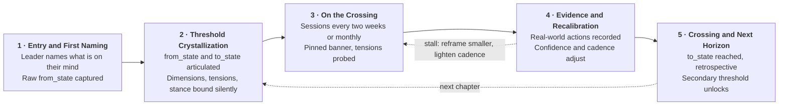
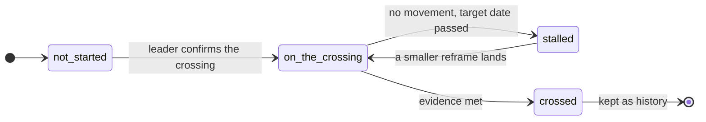

# Sirina / Buraq: Leader Journey Map

From a leader's first message to the crossing of their first threshold, and on to the next. Built from the five-layer context model in `context-layer/`.

## The journey

## Walkthrough

| Stage | Leader experience | Behind the scenes | Key artifact or milestone |
|---|---|---|---|
| **1. Entry and First Naming** _First session, one sitting_ | • Arrives at the quiet salon: one calm chat, no forms, no scores. • Is asked one open question: "What would you like to bring today?" • Writes in their own words. It can be a problem, a feeling or a decision. • Feels heard, not assessed. The agent reflects their language back, with no labels and no advice. | • **Layer 1:** identity record created. Role, org, mandate and success definition come only from the leader and are stamped `leader_words` with a refresh date. Nothing is inferred. • **Layer 2:** a draft threshold opens as `not_started`, holding the raw `from_state` in the leader's words. No dimension or steed is bound yet. • **Layer 5:** first `session` entry appended. `source.said` holds what they wrote; `source.inferred` stays light. • **Stance:** none applied yet. The agent listens and does not diagnose. Layer 3 stays empty, and any early observations are dated notes in Layer 5. • **Confidentiality:** only what the leader writes in the session is stored. No client documents are ingested. | • **First Naming:** the raw `from_state`, verbatim. • Identity card, confirmed by the leader. |
| **2. Threshold Crystallization (Intake)** _Sessions 1 and 2_ | • Answers four plain questions: where do you want to go, where are you now, where will you be, what pulls you back. • Sees the crossing take shape as a one-line title in their own words, and edits it until it sounds right. • Names the stakes of staying put and their main resistance, in first person. • Agrees one small first practice, with a definition of done they can observe. • Sees: the title, a from → to card and the pinned banner. Does not see steeds, dimension names or confidence scores. | • **Layer 2 completed:** `title`, `from_state`, `to_state`, `resistance`, `stakes`, `evidence` (observable behavior), `dates`. Set `is_primary: true`, since only one threshold is primary at a time. • **Silent binding:** `dimension` (up to 2 primary, 3 secondary, from the six aspects) and `archetype` (up to 2 primary steeds, chosen from `vocab.json`). The agent writes `stance_notes`, marked internal only. Anything the agent chose is stamped `agent_inference`. • **Tension fields:** each is two sides the threshold actually holds, with `pull_a`, `pull_b`, `state: active` and `intensity` 1 to 5. • **Confidence:** first score 1 to 5, with a written reason. • **Layer 3:** first wiring hypothesis: ranked values (max 3), feedback form (blunt or own-insight), triggers and shadow. Dated, never final. • **Layer 4:** first practice: rhythm, definition of done, tracking and the agent's role (prompt, hold silence or escalate). • **Checks:** the validator rejects two primaries, tensions on things the threshold does not hold, and missing sources. A stance with no link to the chosen dimensions raises a warning for the coach. | • **Threshold Card:** title, from → to, stakes, resistance. • The agent's private brief for the leader (not shown unless the coach inspects it). |
| **3. Cadence and Crossing (On the Crossing)** _Every two weeks, or monthly_ | • Returns on a steady rhythm and opens to the pinned banner: "Working on" the crossing, with its status. • The agent opens with the practice, not a status report. "What did the team decide without you?" • Hears two pulls named back in plain words, with permission to hold both. "Part of you wants X; part wants Y. No need to choose yet." • Notices the agent's tone fits them: questions for some leaders, direct and specific for others. • Leaves with one concrete commitment. | • **Session load:** reads Layer 1 (checks refresh date), the primary threshold in Layer 2 with its tensions and `stance_notes`, Layer 3 wiring, active practices in Layer 4 and the last log entries in Layer 5. • **Stance mechanics:** the stance changes behavior, not vocabulary. Buraq widens the scope. Pegasus declines to flatter. Rakhsh with Kanthaka holds both pulls and does not rush the cut. The brief forbids naming the stance, the steeds or the layers. • **Tension probing:** the agent works the highest-intensity `active` tension, holds both sides and does not resolve it for the leader. • **Writes:** a new Layer 5 entry (`session` or `check_in`) with dated agent notes and `commitments_made`. Layer 4 streaks update. Layer 2 tension `state` and `intensity` are re-rated. • **Guardrail:** each steed carries a named failure mode, such as Pegasus becoming cold withholding, and the brief tells the agent to avoid it. | • **Session entry** in the relationship log. • Updated practice and streak. • Two-line recap for the leader, ending in their commitment. |
| **4. Evidence and Recalibration** _Continuous, reviewed each session_ | • Brings real moments: "Two product calls shipped without my sign-off." The agent records them in their words, and the evidence list on the threshold card grows. • On a slip, meets no judgment. The agent names the pattern gently and offers a smaller frame, such as "one sentence I owe Sam" in place of "the conversation". • Sees the rhythm adapt: steady while progressing, lighter while stalled. | • **Layer 5:** wins are `breakthrough`, misses are `slip` (logged without judgment) and a smaller ask is a `reframe`. Each commitment gets an outcome (`kept`, `missed` or `pending`) pointing at the later entry that settled it. • **Layer 2:** evidence appended. Confidence score and reason re-rated. Status moves to `stalled` when there is no movement and the target date has passed. Tension intensity re-rated. The leader, not the agent, resets target dates. • **Layer 3:** a read proven wrong is changed and logged as a dated `revision`, for example a feedback form flipped from "own insight" to "direct". • **Layer 4:** streaks update, practices pause or retire, and a smaller practice replaces one that keeps slipping. • **Cadence (proposed rule):** progress holds or lengthens the rhythm. A stall sets `monthly_until_restarted` and shrinks the ask. Confidence rises on evidence and streaks, and falls on missed commitments, changes of subject and a passed target date. | • **Evidence ledger:** what changed, in the leader's words. • **Confidence trend:** score and reason over time. • **Recalibration note:** what changed and why. |
| **5. The Crossing and Next Horizon** _When the evidence is met_ | • Recognizes it themselves: the evidence they named at intake has happened. • The agent reflects the whole trajectory back, from → to, using their own earlier words as proof. • Takes a short retrospective: what carried you, and what would you tell yourself at the start. • Is offered the next chapter: the secondary threshold(s) already waiting. They choose one, restate it in their own words and the banner changes. | • **Layer 2:** status `crossed`, `dates.crossed` set, `is_primary` false. The record is never deleted and becomes proof for later sessions. Its tensions are marked `resolved`. • **Unlock:** a secondary threshold is promoted to primary. If the agent had inferred it, the leader's restated title replaces it and the source becomes `leader_words`. • **Layer 4:** practices tied to the crossed threshold are `retired`. Any worth keeping are linked to the new threshold. • **Layer 3 and the stance:** wiring is reviewed and revisions logged. The steed stance is re-chosen for the new crossing and may change. • **Layer 5:** a `breakthrough` entry with the retrospective. • **Layer 1:** reconfirmed with the leader. A role or mandate change invalidates the Layer 2 records that depend on it. | • **Crossing Record:** from, to, evidence, dates and the retrospective. • **Next Threshold Card:** the new primary crossing. |

## What each stage touches

`W` writes to the layer, `R` reads it, `·` leaves it untouched.

| Layer | Stage 1 | Stage 2 | Stage 3 | Stage 4 | Stage 5 |
|---|:-:|:-:|:-:|:-:|:-:|
| Layer 1 Identity | W | R | R | R | W |
| Layer 2 Threshold | W | W | W | W | W |
| Layer 3 Values and Wiring | · | W | R | W | W |
| Layer 4 Practice | · | W | W | W | W |
| Layer 5 Relationship | W | W | W | W | W |

## Life of a threshold

A stall is not a failure state. It lowers the weight of the ask and the rhythm of contact until the leader is ready again.

## Principles that hold at every stage

- **The mythology stays internal.** The leader sees plain language. Steeds, dimension names and confidence scores are never shown to them.
- **Every entry is sourced.** Each record says whether the leader said it, a session produced it or the agent inferred it. Inferred records wait for the leader's own words.
- **Wiring is a hypothesis.** It carries a date and is revised when the leader proves it wrong.
- **History is append-only.** Slips are logged without judgment, and crossed thresholds are kept as proof.
- **Only the coach's own material enters.** No client data or documents are ingested.

## Where this stands today

**Built**
- Layers 1 to 5 as JSON, with three synthetic leaders and a validator that enforces the spec's rules.
- One screen per stage with a stage navigator: the quiet room (1), a six-question intake that produces a threshold card (2), the chat with a pinned banner, practice check-in and end-of-session recap (3), evidence and recalibration (4), and the crossing record with next horizon (5).
- A coach view that shows which layers each screen touches, and the private binding the leader never sees.
- A brand-new leader can walk stages 1 to 5 end to end. The per-reply brief is built from the layers, with stance notes and a rule never to name the stance.

**Still to build**
- Changes are stored in the browser only. Nothing is written back to the JSON layer files, and there are no accounts.
- The first-session replies in stage 1 are scripted, even when live replies are on. The silent binding in stage 2 is a keyword guess, not a model judgment.
- Confidence and cadence do not adjust on their own. The rules in stage 4 are proposals the coach applies.
- No session scheduling or reminders.
